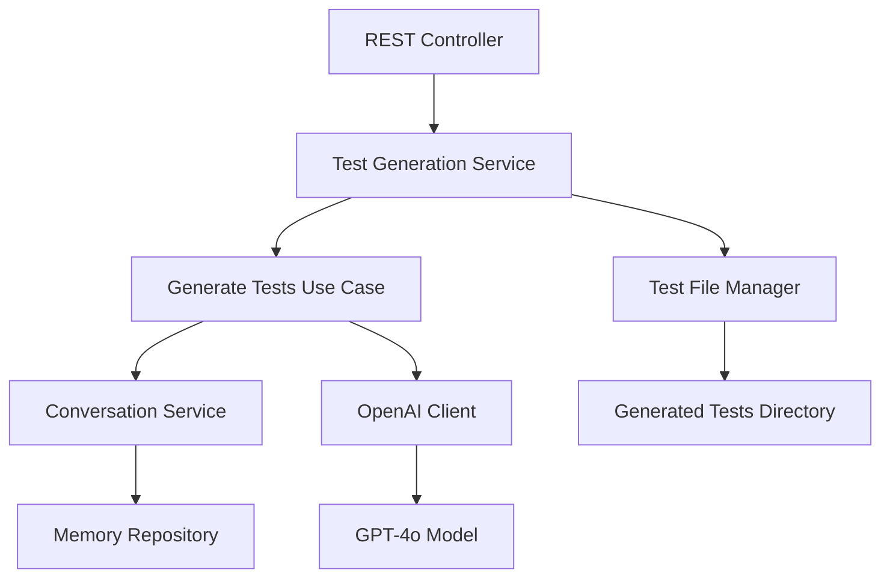

# Unit Test Generator for Spring Boot Applications

> **Unit Test Generation for Spring Boot Applications via user prompts**

[](https://spring.io/projects/spring-boot)
[](https://docs.spring.io/spring-ai/reference/)
[](https://www.oracle.com/java/)
[](https://openai.com/)
[](LICENSE)

TestGen AI is an intelligent test generation system that leverages OpenAI's GPT-4o model to automatically create comprehensive, production-ready unit tests for Spring Boot applications. Built with Spring AI framework, it provides contextual conversation memory and generates high-quality JUnit 5 tests following enterprise standards.

## 🌟 Features

### Intelligent Test Generation
- **AI-Powered Analysis**: Uses GPT-4o to understand code structure and generate appropriate tests
- **Multi-Layer Support**: Generates tests for Repository, Service, Controller, and Integration layers
- **Production-Ready Code**: Creates executable tests with proper mocking, assertions, and error handling

### 💬 Conversational Interface
- **Context-Aware Memory**: Maintains conversation history for iterative test refinement
- **Session Management**: Supports multiple concurrent user sessions
- **Interactive Refinement**: Allows users to request modifications and improvements

### Enterprise-Grade Standards
- **JUnit 5 + Mockito + AssertJ**: Uses modern testing frameworks and best practices
- **Spring Boot Test Slices**: Leverages `@DataJpaTest`, `@WebMvcTest`, and other specialized annotations
- **Comprehensive Coverage**: Includes happy path, edge cases, and error conditions

### 🔧 Advanced Configuration
- **Flexible Memory Strategies**: Configurable conversation memory management
- **Customizable Prompts**: Extensible prompt engineering system
- **Output Management**: Organized test file generation with metadata tracking

## Quick Start

### Prerequisites

- **Java 17+**
- **Maven 3.6+**
- **OpenAI API Key**

### Installation

1. **Clone the repository**
   ```bash
   git clone https://github.com/your-username/testgen-ai.git
   cd testgen-ai
   ```

2. **Configure OpenAI API Key**
   
   Update `src/main/resources/application.properties`:
   ```properties
   spring.ai.openai.api-key=your-openai-api-key-here
   ```
   
   Or set as environment variable:
   ```bash
   export SPRING_AI_OPENAI_API_KEY=your-openai-api-key-here
   ```

3. **Build and run the application**
   ```bash
   ./mvnw clean install
   ./mvnw spring-boot:run
   ```

4. **Verify the application is running**
   ```bash
   curl http://localhost:8080/api/test-generation/health
   ```

## Usage

### REST API Endpoint

**Generate Tests**
```http
POST /api/test-generation/generate
Content-Type: application/json
```

**Request Body:**
```json
{
  "userInput": "Generate tests for UserService create and update methods",
  "classSourceCode": "public class UserService { ... }",
  "sessionId": "user-session-123",
  "conversationId": "conv-456",
  "continuingConversation": false
}
```

**Response:**
```json
{
  "sessionId": "user-session-123",
  "conversationId": "conv-456",
  "status": "SUCCESS",
  "generatedTestCode": "package com.example.service;\n\n@ExtendWith(MockitoExtension.class)...",
  "className": "UserService",
  "targetLayer": "SERVICE",
  "generatedAt": "2024-08-26T10:30:00Z",
  "newConversation": true
}
```

### Example Usage with cURL

```bash
# Generate tests for a service class
curl -X POST http://localhost:8080/api/test-generation/generate \
  -H "Content-Type: application/json" \
  -d '{
    "userInput": "Create comprehensive tests for UserService including validation and error handling",
    "classSourceCode": "public class UserService {\n    public User createUser(User user) {\n        // implementation\n    }\n}",
    "sessionId": "demo-session"
  }'
```

### Continuing Conversations

```bash
# Continue an existing conversation to refine tests
curl -X POST http://localhost:8080/api/test-generation/generate \
  -H "Content-Type: application/json" \
  -d '{
    "userInput": "Add more edge cases for null validation",
    "sessionId": "demo-session",
    "conversationId": "previous-conversation-id",
    "continuingConversation": true
  }'
```

## Architecture

### System Overview



### Domain Model

The application follows Domain-Driven Design principles with clear separation of concerns:

- **Domain Layer**: Core business logic and entities
- **Application Layer**: Use cases and services orchestration
- **Infrastructure Layer**: External integrations (OpenAI, file system)
- **Interface Layer**: REST controllers and DTOs

### Key Components

| Component | Description |
|-----------|-------------|
| `TestGenerationController` | REST API endpoint for test generation requests |
| `TestGenerationService` | Core service orchestrating test generation workflow |
| `ConversationService` | Manages conversation memory and context |
| `OpenAiClient` | Integration with OpenAI GPT-4o model |
| `PromptRefiner` | Enhances user prompts with context and examples |
| `TestFileManager` | Handles test file creation and organization |

## ⚙️ Configuration

### Application Properties

```properties
# OpenAI Configuration
spring.ai.openai.api-key=your-api-key
spring.ai.openai.chat.options.model=gpt-4o
spring.ai.openai.chat.options.temperature=0.1
spring.ai.openai.chat.options.max-tokens=8000

# Conversation Memory Settings
testgen.conversation.default-memory-strategy=message-window
testgen.conversation.max-messages-per-conversation=50
testgen.conversation.conversation-timeout-minutes=30
testgen.conversation.auto-summarize-threshold=100

# Output Configuration
testgen.output.directory=generated-tests

# Database Configuration (H2 for conversation memory)
spring.datasource.url=jdbc:h2:mem:testdb
spring.h2.console.enabled=true
```

### Memory Strategies

- **Message Window**: Keeps last N messages in memory
- **Token Limit**: Maintains conversation within token limits
- **Summarization**: Auto-summarizes old conversations

### Logging Configuration

```properties
logging.level.com.univade.ai=DEBUG
logging.level.org.springframework.ai=INFO
logging.level.org.springframework.ai.chat.memory=DEBUG
```

## Generated Test Examples

### Service Layer Test

```java
@ExtendWith(MockitoExtension.class)
@DisplayName("UserService Tests")
class UserServiceTest {
    
    @Mock private UserRepository userRepository;
    @InjectMocks private UserService userService;
    
    @Test
    @DisplayName("Should create user with valid data")
    void shouldCreateUserWithValidData() {
        // Given
        User user = UserTestDataBuilder.aValidUser().build();
        when(userRepository.save(any(User.class))).thenReturn(user);
        
        // When
        User result = userService.createUser(user);
        
        // Then
        assertThat(result).isNotNull();
        assertThat(result.getId()).isNotNull();
        verify(userRepository).save(user);
    }
    
    @Test
    @DisplayName("Should throw IllegalArgumentException when user is null")
    void shouldThrowIllegalArgumentExceptionWhenUserIsNull() {
        // When & Then
        assertThatThrownBy(() -> userService.createUser(null))
            .isInstanceOf(IllegalArgumentException.class)
            .hasMessage("User cannot be null");
    }
}
```

### Repository Layer Test

```java
@DataJpaTest
@DisplayName("UserRepository Tests")
class UserRepositoryTest {
    
    @Autowired private TestEntityManager entityManager;
    @Autowired private UserRepository userRepository;
    
    @Test
    @DisplayName("Should save user and generate ID")
    void shouldSaveUserAndGenerateId() {
        // Given
        User user = new User("john@example.com", "John Doe");
        
        // When
        User savedUser = userRepository.save(user);
        
        // Then
        assertThat(savedUser.getId()).isNotNull();
        assertThat(savedUser.getEmail()).isEqualTo("john@example.com");
    }
}
```

## 🔧 Development

### Building from Source

```bash
# Clone repository
git clone https://github.com/your-username/testgen-ai.git
cd testgen-ai

# Build with tests
./mvnw clean install

# Run without tests
./mvnw clean install -DskipTests

# Run with specific profile
./mvnw spring-boot:run -Dspring-boot.run.profiles=dev
```

### Running Tests

```bash
# Run all tests
./mvnw test

# Run specific test class
./mvnw test -Dtest=TestGenerationServiceTest

# Run with coverage
./mvnw test jacoco:report
```

### Development Setup

1. **IDE Configuration**: Configure your IDE for Spring Boot development
2. **Code Style**: Follow Google Java Style Guide
3. **Pre-commit Hooks**: Set up formatting and linting hooks

## 📈 Performance & Scaling

### Performance Characteristics

- **Response Time**: Typically 5-15 seconds for test generation
- **Throughput**: Handles multiple concurrent sessions
- **Memory Usage**: Configurable conversation memory limits
- **Token Efficiency**: Optimized prompts for minimal token usage

### Scaling Considerations

- **Horizontal Scaling**: Stateless design allows easy horizontal scaling
- **Database**: Consider PostgreSQL for production deployments
- **Caching**: Implement Redis for conversation memory in distributed setups
- **Rate Limiting**: Configure OpenAI API rate limits appropriately

## 🛡️ Security

### Best Practices

- **API Key Management**: Store OpenAI API keys securely
- **Input Validation**: Validate all user inputs
- **Session Management**: Implement proper session timeouts
- **Audit Logging**: Log all test generation requests

### Production Deployment

```properties
# Remove H2 console in production
spring.h2.console.enabled=false

# Use secure database
spring.datasource.url=jdbc:postgresql://localhost:5432/testgen

# Enable security headers
server.servlet.session.cookie.secure=true
server.servlet.session.cookie.http-only=true
```

## 🤝 Contributing

We welcome contributions! Please see our [Contributing Guidelines](CONTRIBUTING.md) for details.

### Development Workflow

1. Fork the repository
2. Create a feature branch (`git checkout -b feature/amazing-feature`)
3. Commit your changes (`git commit -m 'Add amazing feature'`)
4. Push to the branch (`git push origin feature/amazing-feature`)
5. Open a Pull Request

### Code Standards

- Follow Google Java Style Guide
- Write comprehensive tests for new features
- Update documentation for API changes
- Ensure all tests pass before submitting PR

## 📋 Roadmap

### Version 1.1.0
- [ ] Support for additional test frameworks (TestNG)
- [ ] Integration with more AI models (Claude, Gemini)
- [ ] Test execution and validation feedback
- [ ] Web UI for easier interaction

### Version 1.2.0
- [ ] Plugin for popular IDEs (IntelliJ, VS Code)
- [ ] Batch test generation for entire projects
- [ ] Custom prompt templates
- [ ] Advanced test metrics and reporting

### Version 2.0.0
- [ ] Multi-language support (Python, JavaScript)
- [ ] Advanced AI reasoning for complex scenarios
- [ ] Integration with CI/CD pipelines
- [ ] Enterprise authentication and authorization

## 📄 License

This project is licensed under the MIT License - see the [LICENSE](LICENSE) file for details.

## 🙏 Acknowledgments

- [Spring AI](https://docs.spring.io/spring-ai/reference/) team for the excellent AI integration framework
- [OpenAI](https://openai.com/) for providing powerful language models
- [Spring Boot](https://spring.io/projects/spring-boot) community for the robust application framework

---
